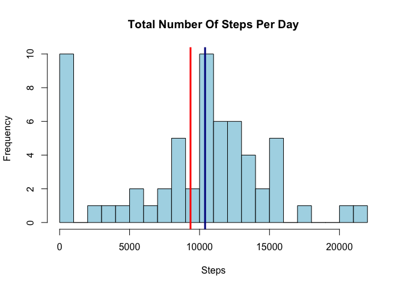
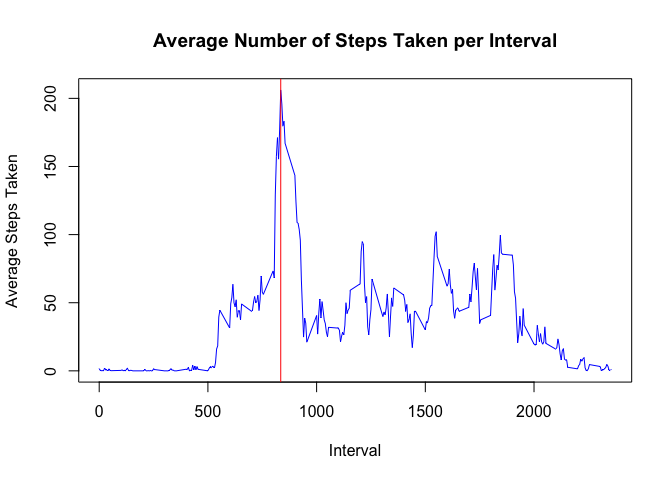
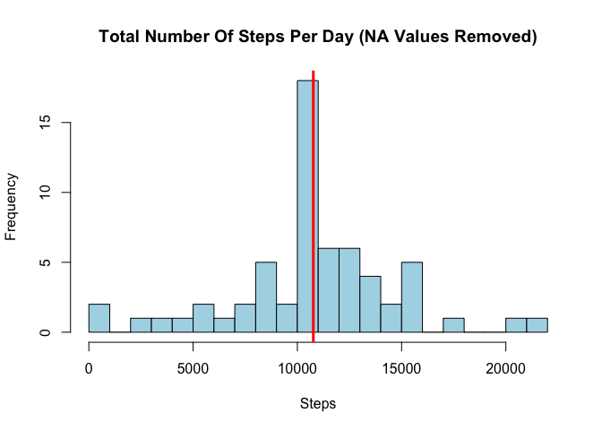
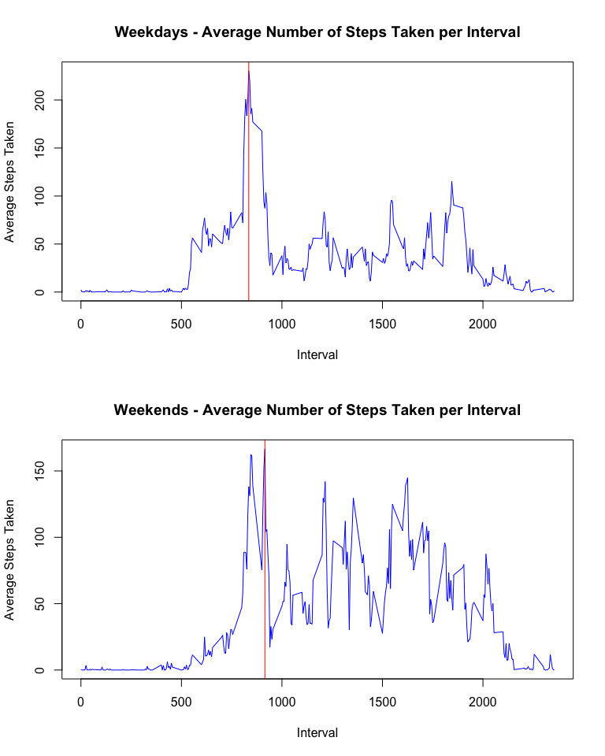

# Reproducible Research: Peer Assessment 1


## Loading and preprocessing the data

First, we'll download the activity file and load the data set. We'll then format the date field to allow us to analyze the data more easily. [NB - For this assignment the data has already been provided in the forked github repo. In the interest of thoroughness, we'll check for the existence of the file and provide an alternate download location in the event that it is not found.]


```r
## Check if zip file is already downloaded. If not download to working directory.
zipdl <- "activity.zip"
if (!file.exists(zipdl)) {
        download.file("https://d396qusza40orc.cloudfront.net/repdata%2Fdata%2Factivity.zip", destfile=zipdl, method="curl")
}
## Unzip the file
unzip(zipdl)

## Load data
activity <- read.csv("activity.csv", header=TRUE, sep=",", na.strings="NA")

## Format data field
activity$date <- as.Date(activity$date)
```

## What is mean total number of steps taken per day?

Now that we've got some data, it's time to work with it. We'll first calculate the total number of steps per day and create a histogram to display that information. We'll then calculate and display the mean and median of those values.


```r
## Total Steps Per Day
totalStepsDay <- aggregate(activity$steps, by=list(activity$date), FUN=sum, na.rm=T)

## Create Histogram
hist(
        x=totalStepsDay$x,
        main="Total Number Of Steps Per Day",
        xlab="Steps",
        ylab="Frequency",
        breaks=25,
        col="light blue",       
)

## Calculate Mean & Median. Display results in body of Markup.
meanStepsDay <- mean(totalStepsDay$x, na.rm=T)
medianStepsDay <- median(totalStepsDay$x, na.rm=T)

## Add vertical mean/median lines on plot
abline(v=meanStepsDay, col="red", lwd=3)
abline(v=medianStepsDay, col="dark blue", lwd=3)
```

 

And so, as calculated above, the mean number of steps taken per day is <span style="color:red">9354.23</span> and the median number of steps taken per day is <span style="color:darkblue">10395</span> (included on the plot above as vertical lines of the corresponding colors).


## What is the average daily activity pattern?

We'll now look at the average number of steps taken over each interval and display that data in a plot.


```r
## Average steps per interval
meanStepsInterval <- aggregate(activity$steps, by=list(activity$interval), FUN=mean, na.rm=T)

## Create plot
plot( x=meanStepsInterval[,1], 
      y=meanStepsInterval[,2],
      main="Average Number of Steps Taken per Interval",
      ylab="Average Steps Taken", 
      xlab="Interval",
      type="l",
      col="blue")

## Calculate interval with maximum steps, display in Markup
maxInterval <- meanStepsInterval[which.max(meanStepsInterval[,2]),1]

## Add abline showing max to plot
abline(v=maxInterval, col="red", lwd=1)
```

 

The interval with the maximum number of steps taken is <span style="color:red">835</span>. It's displayed in the plot above as a red line.


## Imputing missing values

Now about those missing values in the dataset...


```r
missing <- sum(is.na(activity))
```

It seems that there are <span style="color:red">2304</span> records containing 'NA' values in our dataset. Let's replace those with the mean value for the interval corresponding to each 'NA'. We can then create a new histogram and recalculate the mean and median for the new, cleaned up, dataset.


```r
## Create our new data set, adding the mean steps matched by inetrval
activityComplete <- cbind(activity, meanStepsInterval[,2])
names(activityComplete)[4] <- c("meanSteps")

## Replace NA values with corresponding mean value
activityComplete <- transform(activityComplete, steps = ifelse(is.na(steps), meanSteps, steps))

## Calculate mean and median for new dataset
noNA_totalStepsDay <- aggregate(activityComplete$steps, by=list(activityComplete$date), FUN=sum, na.rm=T)
noNA_meanStepsDay <- mean(noNA_totalStepsDay$x, na.rm=T)
noNA_medianStepsDay <- median(noNA_totalStepsDay$x, na.rm=T)

## Create new histogram
hist(
        x=noNA_totalStepsDay$x,
        main="Total Number Of Steps Per Day (NA Values Removed)",
        xlab="Steps",
        ylab="Frequency",
        breaks=25,
        col="light blue"
)

## Add vertical mean line (median is identical, so omit...)
abline(v=noNA_meanStepsDay, col="red", lwd=3)
```

 

After replacing the NA values with the means for the corresponding interval, the mean number of steps taken per day is <span style="color:red">10766.19</span> and the median number of steps taken per day is <span style="color:red">10766.19</span> (both included in the plot above as a red line. NB - In this case the median represents as a decimal because in replacing NA values with the interval mean, we essentially added data stating that some intervals contained partial steps/decimal values). By removing the NA values in the data set and replacing them with the average values for the corresponding interval, we skew the data toward the center. In the histogram above, one can see that the poisson ditribution of the data remains, but the peak of the centermost values in the distribution is much more sever than in the first representation (which simply ignored the NAs). Also evident is that the extreme values - particularly the 0 results - are eclipsed by the severe bent toward the mean. This suggests to me that by replacing NA values with the mean data we have potentially obscured outlying data points.

## Are there differences in activity patterns between weekdays and weekends?

We can now split our dataset to see if we notice any changes in activity from weekdays to weekends.


```r
## Create columns in the data set to identify weekday/weekend factor
activityComplete$day <- weekdays(activityComplete$date)
activityComplete$dayFactor <- as.factor(ifelse(activityComplete$day %in% c("Saturday","Sunday"), "Weekend", "Weekday"))

## Separate datasets based on weekday/weekend factor
weekdayActivity <- activityComplete[activityComplete$dayFactor=="Weekday",]
weekendActivity <- activityComplete[activityComplete$dayFactor=="Weekend",]

## Calculate means for separated datasets
weekdayStepsInterval <- aggregate(weekdayActivity$steps, by=list(weekdayActivity$interval), FUN=mean, na.rm=T)
weekendStepsInterval <- aggregate(weekendActivity$steps, by=list(weekendActivity$interval), FUN=mean, na.rm=T)

## Calculate interval with maximum steps, display in Markup
maxWkdyInterval <- weekdayStepsInterval[which.max(weekdayStepsInterval[,2]),1]
maxWkndInterval <- weekendStepsInterval[which.max(weekendStepsInterval[,2]),1]
```

And we can display the results on a pair of plots for a visual comparison:


```r
## Note to peer reviewer: this was the only plot that required me to set dimensions in order to display it legibly. I'd be curious if it represents properly to you. Including the OS and graphics device used ot view would be helpful information. Thank you! 

## Create plot
par(mfcol=c(2,1))
plot( x=weekdayStepsInterval[,1], 
      y=weekdayStepsInterval[,2],
      main="Weekdays - Average Number of Steps Taken per Interval",
      ylab="Average Steps Taken", 
      xlab="Interval",
      type="l",
      col="blue")
## Add abline showing max to plot
abline(v=maxWkdyInterval, col="red", lwd=1)

plot( x=weekendStepsInterval[,1], 
      y=weekendStepsInterval[,2], 
      main="Weekends - Average Number of Steps Taken per Interval",
      ylab="Average Steps Taken", 
      xlab="Interval",
      type="l",
      col="blue")
## Add abline showing max to plot
abline(v=maxWkndInterval, col="red", lwd=1)
```

 

The results of this dual plot are interesting, if not surprising. In both data sets we see little activity during intervals 0-500, suggesting stationary - likely sleeping - participants. On weekdays, we see a peak at <span style="color:red">835</span>, exactly the same maximum as our overall (undivided) set. One could imagine this activity being the result of starting the day, perhaps morning exercise coupled with a morning commute. We then see a more static baseline of activity, as to suggest the stationary behavior one would display at work or school. We see a similar early peak on the weekends, at <span style="color:red">915</span>, though afterward we see a more varied distribution of activity scattered throughout the day. One could surmise that this is because the average person doesn't adhere to as rigid a schedule on weekends, and therefore more and varied activity is possible/likely. In both data sets we see a decrease in activity in the higher intervals (>2000), though the decrease begins a bit later on weekends than it does on weekdays. This is also in line with expected behavior of most individuals on weekend days vs. weekdays.

